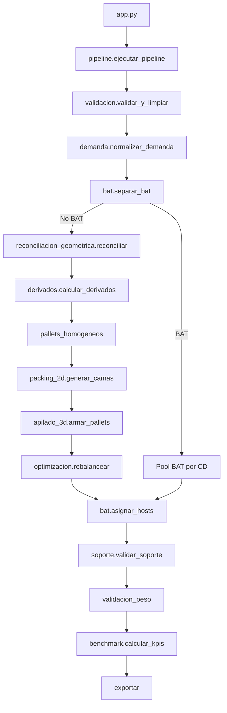

# Documentación técnica — Agente Cubicador V3

**Repo:** `agente-cubicador-transportes-bees`  
**Versión técnica propuesta:** `v3`  
**Objetivo:** adaptar la arquitectura actual a la reconciliación Maestro↔UMA, BAT dinámico, soporte explícito y benchmarking contra `Cubicado Real`.

---

# 1. Cambios estructurales respecto a V2

V3 introduce cuatro cambios centrales:

1. **Reconciliación geométrica previa al packing.**
2. **BAT fuera del packing normal y asignado mediante hosts dinámicos.**
3. **Separación de cama portante y cama terminal.**
4. **Benchmark reproducible contra los 42 pallets reales.**

Además:

- desaparece la rotación XYZ/acostada del flujo productivo;
- `Cajas por cama` del Maestro deja de reducirse automáticamente por geometría UMA;
- altura se calcula siempre desde una única función;
- parámetros de peso quedan desacoplados de supuestos no validados;
- se mejora la trazabilidad de geometrías inferidas.

---

# 2. Arquitectura propuesta

```text
agente-cubicador-transportes-bees/
├── app.py
├── config.py
├── models.py
├── visualizacion.py
├── src/
│   ├── validacion.py
│   ├── derivados.py
│   ├── reconciliacion_geometrica.py      # NUEVO
│   ├── demanda.py                        # NUEVO
│   ├── bat.py                            # NUEVO
│   ├── pallets_homogeneos.py
│   ├── packing_2d.py
│   ├── soporte.py                        # NUEVO
│   ├── apilado_3d.py
│   ├── optimizacion.py                   # NUEVO
│   ├── validacion_peso.py
│   ├── benchmark.py                      # NUEVO
│   ├── exportar.py
│   ├── pipeline.py
│   └── template.py
├── tests/
│   ├── test_reconciliacion_geometrica.py
│   ├── test_bat.py
│   ├── test_soporte.py
│   ├── test_benchmark_real.py
│   └── ...
├── DOCUMENTACION_LOGICA_V3.md
└── DOCUMENTACION_TECNICA_V3.md
```

---

# 3. Flujo V3



---

# 4. Nuevos contratos de datos

## 4.1 `GeometriaSKU`

```python
@dataclass
class GeometriaSKU:
    sku: str
    largo_uma: float | None
    ancho_uma: float | None
    alto_uma: float
    largo_efectivo: float
    ancho_efectivo: float
    alto_efectivo: float
    cajas_cama_maestro: int | None
    capacidad_uma: int | None
    fuente_geometria: str
    delta_largo: float | None
    delta_ancho: float | None
    requiere_revision: bool
```

Valores posibles de `fuente_geometria`:

- `UMA_VALIDADA`
- `UMA_SOBRECAPACIDAD`
- `INFERIDA_MAESTRO`
- `DATO_INSUFICIENTE`

## 4.2 `CajaBAT`

```python
@dataclass
class CajaBAT:
    cd: str
    id_bat: str
    unidades: int
    largo: float = 45.0
    ancho: float = 24.0
    alto: float = 55.0
    pallet_host_id: str | None = None
```

## 4.3 `Cama`

Agregar:

- `tipo_soporte: Literal["PORTANTE", "TERMINAL"]`
- `altura_min_cajas`
- `altura_max_cajas`
- `desnivel`
- `support_ratio_min`
- `geometria_inferida: bool`

## 4.4 `Pallet`

Agregar:

- `altura_pre_bat`
- `altura_final`
- `cajas_bat: list[CajaBAT]`
- `altura_target_delta`
- `es_host_bat`
- `support_ratio_min`
- `benchmark_match_id` opcional

---

# 5. `reconciliacion_geometrica.py`

## 5.1 Objetivo

Determinar la geometría efectiva de cada SKU antes del packing.

## 5.2 Funciones

```python
def capacidad_orientacion_unica(
    pallet_largo: float,
    pallet_ancho: float,
    caja_largo: float,
    caja_ancho: float
) -> int:
    ...

def capacidad_xy_max(
    largo: float,
    ancho: float
) -> tuple[int, str]:
    ...

def inferir_footprint_desde_cajas_cama(
    cajas_cama: int,
    largo_uma: float,
    ancho_uma: float
) -> tuple[float, float, dict]:
    ...

def reconciliar_sku(row) -> GeometriaSKU:
    ...

def reconciliar(df) -> tuple[pd.DataFrame, pd.DataFrame]:
    ...
```

## 5.3 Regla de inferencia

Buscar configuraciones `filas × columnas` que permitan colocar al menos `N = cajas_cama_maestro` usando una única orientación.

Para cada configuración candidata:

- `largo_max_caja = 120 / columnas`
- `ancho_max_caja = 100 / filas`

Evaluar ambas rotaciones.

Score recomendado:

```text
score =
  peso_delta_dimensiones
+ penalización_espacio_vacío
+ penalización_cambio_aspect_ratio
```

Elegir la solución de menor score.

### Importante

La salida es **geometría efectiva inferida**, no “medida real”.

---

# 6. Cambio en `_capacidad_real_cama`

Eliminar la lógica conceptual:

```python
min(cajas_cama_maestro, capacidad_geometrica_uma)
```

como regla general.

Nueva lógica:

```python
if cajas_cama_maestro_valida:
    capacidad_operacional = cajas_cama_maestro
else:
    capacidad_operacional = capacidad_geometrica_efectiva
```

La geometría efectiva debe haber sido reconciliada previamente.

---

# 7. Rotaciones

Eliminar del flujo productivo:

- `Puede_Acostarse`
- uso de Alto como Largo/Ancho
- cualquier orientación XYZ distinta de XY

Mantener únicamente:

```python
(largo, ancho, alto)
(ancho, largo, alto)
```

`alto` siempre constante.

La lógica experimental de cajas acostadas puede conservarse fuera del pipeline productivo si se desea investigar posteriormente.

---

# 8. Demanda a nivel unidades

## 8.1 Problema

`ceil(Cajas_Teoricas)` puede producir sobre-despacho respecto de la demanda equivalente original.

## 8.2 Nuevo contrato

Crear:

```python
Demanda_Unidades_Oficial
Unidades_por_Caja
Cajas_Completas
Unidades_Fraccionarias
```

El invariante principal compara unidades planificadas contra unidades oficiales.

Si una categoría requiere redondeo a caja completa, debe existir una regla explícita:

```python
Politica_Redondeo = "CAJA_COMPLETA"
```

y el exceso debe quedar cuantificado en output.

BAT se maneja directamente en unidades.

---

# 9. `bat.py`

## 9.1 Separación

```python
def separar_bat(df) -> tuple[pd.DataFrame, pd.DataFrame]:
    # Retorna demanda_no_bat y demanda_bat
    ...
```

La identificación debe basarse en una categoría logística normalizada explícita, no en un valor numérico genérico compartido por otros productos.

## 9.2 Consolidación

```python
CAJA_BAT_LARGO = 45.0
CAJA_BAT_ANCHO = 24.0
CAJA_BAT_ALTO = 55.0
CAJA_BAT_CAPACIDAD_UNIDADES = 500
```

```python
def consolidar_bat_por_cd(df_bat) -> dict[str, list[CajaBAT]]:
    n = ceil(total_unidades_cd / 500)
```

## 9.3 Host dinámico

Eliminar `RESERVA_ALTURA_REMATE = 55` aplicada globalmente a BAT.

Nueva función:

```python
def asignar_hosts_bat(
    pallets: list[Pallet],
    cajas_bat_por_cd: dict[str, list[CajaBAT]],
    altura_target: float
) -> None:
    ...
```

Score inicial:

```python
score = abs((pallet.altura_final + 55) - ALTURA_TARGET)
```

Filtros:

- mismo CD;
- sin remate incompatible;
- altura proyectada dentro del rango permitido;
- peso proyectado permitido;
- soporte aceptable.

Una caja BAT se coloca como remate.

Si existen varias cajas BAT en un CD, se requieren tantos hosts como cajas, salvo que operación valide apilar más de una caja BAT sobre el mismo pallet.

Por defecto V3 asume **una caja BAT por host**.

---

# 10. Altura única y consistente

Crear una sola función:

```python
def calcular_altura_pallet(pallet: Pallet) -> float:
    return (
        ALTURA_PALLET_VACIO
        + sum(c.altura_cama for c in pallet.camas)
        + sum(b.alto for b in pallet.cajas_bat)
    )
```

Todo el sistema debe utilizar esta función.

Eliminar cálculos independientes del tipo:

```python
camas_ph * alto_caja
```

sin altura de tarima.

---

# 11. Altura — configuración

Reemplazar semántica antigua por:

```python
ALTURA_PALLET_VACIO = 15.0

ALTURA_TARGET = 198.3
ALTURA_OPTIMA_MIN = 195.0
ALTURA_OPTIMA_MAX = 200.0

ALTURA_NOMINAL_MIN = 190.0
ALTURA_PARCIAL_OPERATIVA_MIN = 170.0

ALTURA_ALERTA_ALTA = 210.0
ALTURA_MAX_OBSERVADA = 215.0

ALTURA_HARD_VALIDADA = None
```

Mientras `ALTURA_HARD_VALIDADA is None`, el sistema debe diferenciar entre:

- advertencia;
- excepción;
- bloqueo por regla formal.

No convertir 215 automáticamente en hard limit sin validación.

---

# 12. Peso — configuración

Propuesta:

```python
PESO_ALERTA_KG: float | None = None
PESO_HARD_KG: float | None = None
```

o mantener los valores actuales como “provisionales” con bandera:

```python
PESO_PARAMETROS_VALIDADOS = False
```

No usar un hard block basado en un valor no validado sin generar trazabilidad.

Contrato sugerido:

```python
Peso_Valor
Tipo_Peso
Peso_Caja
Peso_No_Validable
```

---

# 13. Packing 2D

## 13.1 Orientación

`_elegir_orientacion` solo compara dos rotaciones XY.

## 13.2 Capacidad operacional

Usar `Cajas_Cama_Efectivo` reconciliado, no recalculado como mínimo contra UMA cruda.

## 13.3 Heurísticas

Hacer estrategia configurable:

```python
ESTRATEGIA_CAMAS = "PURE_FIRST"
# PURE_FIRST
# GLOBAL_MIX
# HYBRID_LOOKAHEAD
```

Así se puede benchmarkear con el mismo dataset.

---

# 14. Cama portante vs terminal

## 14.1 Config

```python
TOLERANCIA_ALTURA_PORTANTE = None  # por calibrar
TOLERANCIA_ALTURA_TERMINAL = None  # por calibrar
```

No reutilizar automáticamente 8 cm para ambas.

## 14.2 Clasificación

Una cama es `TERMINAL` cuando no va a soportar otras camas normales.

Toda cama que soporte carga encima es `PORTANTE`.

## 14.3 Desnivel

```python
desnivel = max(p.h) - min(p.h)
```

Guardar en cada `Cama`.

---

# 15. `soporte.py`

Nuevo módulo para calcular soporte geométrico real.

## 15.1 Función base

```python
def support_ratio(
    caja_superior: Placement,
    placements_inferiores: list[Placement]
) -> float:
    ...
```

Calcular intersección de la base de la caja superior con la unión de áreas soportadas por la cama inferior.

## 15.2 Métrica de cama

```python
support_ratio_min = min(
    support_ratio(caja, cama_inferior.placements)
    for caja in cama_superior.placements
)
```

Inicialmente:

- guardar;
- alertar;
- no bloquear salvo regla validada.

---

# 16. Compatibilidad de categorías

Reemplazar gradualmente:

```python
MAX_SEPARACION_NIVELES = 2
```

por dos estructuras explícitas:

```python
COMPATIBILIDAD_APILADO = {
    # ("categoria_inferior", "categoria_superior"): bool
}

COMPATIBILIDAD_CAMA = {
    # ("categoria_a", "categoria_b"): bool
}
```

No asumir que compatibilidad vertical y compatibilidad dentro de una misma cama son equivalentes.

---

# 17. `apilado_3d.py`

## 17.1 Eliminar reserva BAT global

Quitar para BAT:

```python
if reservar_remate:
    techo -= 55
```

Si existen otros remates con reglas distintas, tratarlos explícitamente.

## 17.2 Objetivo de asignación

El best-fit actual puede mantenerse como baseline, pero el score debe poder incluir:

- altura resultante;
- capacidad de convertirse en host BAT;
- peso;
- residuo de altura;
- calidad de soporte.

## 17.3 Pseudo-score

```text
score =
    W_ALTURA * abs(altura_proyectada - ALTURA_TARGET)
  + W_RESIDUAL * residuo
  + W_SOPORTE * penalizacion_soporte
  + W_BAT * penalizacion_host
```

V3 puede comenzar lexicográficamente antes de usar pesos continuos.

---

# 18. Benchmark reproducible

Crear `benchmark.py`.

```python
@dataclass
class BenchmarkResultado:
    dataset_hash: str
    commit: str
    config_hash: str
    pallets: int
    altura_media: float
    altura_min: float
    altura_max: float
    parciales: int
    demanda_unidades_error: float
    geometria_inferida_count: int
```

## 18.1 Benchmark real

Target actual:

```python
PALLETS_REALES = 42
ALTURA_MEDIA_REAL = 198.3
ALTURA_MIN_REAL = 170.0
ALTURA_MAX_REAL = 215.0
```

El benchmark debe excluir `PALLET = 0` del conteo de pallets físicos.

## 18.2 Error de pallets

```python
error_pallets_pct = (pallets_modelo - 42) / 42
```

## 18.3 Match por pallet real

Si existe suficiente detalle por CD/SKU/Pallet, agregar un modo de auditoría:

```python
auditar_pallet_real(pallet_id, cd)
```

que intente explicar por qué el modelo acepta o rechaza esa composición.

Motivos:

- geometría;
- altura;
- peso;
- categoría;
- soporte;
- BAT;
- regla de mezcla.

---

# 19. Tests nuevos

## 19.1 Geometría

- UMA confirma Maestro.
- UMA sobreestima capacidad.
- UMA subestima Maestro → inferencia.
- Inferencia mantiene alto.
- Solo rotación XY.
- Ninguna caja sobresale.
- Ninguna caja se solapa.

## 19.2 Altura

- PH incluye altura de pallet.
- Todas las alturas usan la misma función.
- BAT suma exactamente 55 cm.
- Pallet 170 cm puede existir como parcial.
- >210 genera alerta/excepción.
- >hard validado bloquea solo si existe hard validado.

## 19.3 BAT

- 0 unidades → 0 cajas.
- 1–500 → 1 caja.
- 501–1000 → 2 cajas.
- consolidación por CD.
- nunca mezcla CDs.
- `PALLET = 0` no cuenta como pallet físico.
- BAT solo se asigna después de cubicaje normal.
- host pertenece al mismo CD.
- BAT siempre está en cima.

## 19.4 Demanda

- reconciliación en unidades exacta.
- redondeo explícito genera delta visible.
- ninguna unidad se pierde en silencio.

## 19.5 Soporte

- support ratio = 1.0 cuando cobertura es total.
- detecta voladizos.
- detecta cama desnivelada.
- cama terminal puede tener tolerancia distinta.

## 19.6 Benchmark

- mismo input → mismo output.
- conteo de pallets excluye `PALLET = 0`.
- reporte contiene hash de dataset/config.

---

# 20. Output V3

Agregar columnas.

## Por línea/SKU

- `CD`
- `Pallet_ID`
- `SKU`
- `Cantidad_Cajas`
- `Cantidad_Unidades`
- `Categoria`
- `Nivel`
- `Cama_ID`
- `Tipo_Cama`
- `Fuente_Geometria`
- `Largo_Efectivo`
- `Ancho_Efectivo`
- `Alto_Efectivo`
- `Geometria_Inferida`

## Por pallet

- `Altura_Pre_BAT`
- `Cajas_BAT`
- `Unidades_BAT`
- `Altura_Final`
- `Peso_Final`
- `Support_Ratio_Min`
- `Delta_Target_198_3`
- `Estado`

## Hoja de auditoría geométrica

- Maestro vs UMA
- capacidad de cada orientación
- estado de reconciliación
- medidas inferidas
- deltas
- motivo

## Hoja benchmark

- real vs modelo
- 42 pallets target
- altura media/min/max
- brechas
- versión/configuración

---

# 21. Parámetros que deben desaparecer o cambiar de significado

| Parámetro V2 | Acción V3 |
|---|---|
| `HABILITAR_CAJAS_ACOSTADAS` | Sacar del pipeline productivo |
| `Puede_Acostarse` | Eliminar del derivado productivo |
| `RESERVA_ALTURA_REMATE = 55` | Eliminar para BAT |
| `MAX_SEPARACION_NIVELES` | Mantener temporalmente; migrar a matriz |
| `FILL_RATIO_MIN_SOPORTE = 0` | No interpretar como seguridad validada |
| `UMBRAL_DATO_NO_CONFIABLE = 10000` | Reemplazar gradualmente por reglas de consistencia |
| `PESO_UMA_ES_POR_UNIDAD` | Sustituir por metadata explícita de tipo de peso |

---

# 22. Orden de implementación recomendado

## PR 1 — Geometría efectiva

- `reconciliacion_geometrica.py`
- nuevas columnas
- tests
- sin cambiar todavía el apilado

## PR 2 — BAT dinámico

- `bat.py`
- eliminar reserva global
- host BAT
- tests 500 unidades

## PR 3 — Altura consistente

- función única de altura
- PH + tarima
- estados de altura

## PR 4 — Demanda por unidades

- conciliación exacta
- políticas explícitas de redondeo

## PR 5 — Portante/terminal + soporte

- `soporte.py`
- desnivel
- support ratio

## PR 6 — Heurística global

- comparar `PURE_FIRST`, `GLOBAL_MIX`, `HYBRID_LOOKAHEAD`

## PR 7 — Benchmark real

- reproducibilidad
- auditoría pallet real
- reporte de brechas

---

# 23. Criterio técnico de aceptación

Un cambio no se acepta solo porque reduzca pallets.

Debe:

1. pasar todos los invariantes;
2. mantener demanda exacta;
3. no introducir rotaciones no permitidas;
4. dejar trazabilidad de inferencias;
5. no empeorar estabilidad sin evidencia;
6. mostrar benchmark real vs modelo;
7. explicar por qué cambió el número de pallets.

El objetivo de calibración inicial es acercarse a:

- **42 pallets**
- **198.3 cm de altura media**
- rango comparable a **170–215 cm**

sin violaciones físicas no explicadas.

Una vez que el motor reproduzca razonablemente la operación humana, recién debe intentarse optimizar por debajo del benchmark real.
