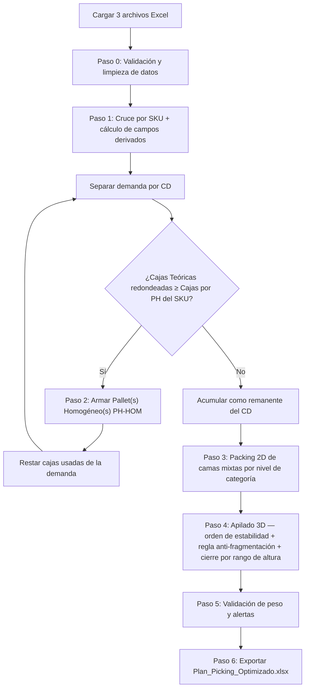
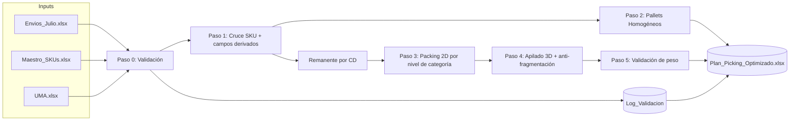

# Motor de Optimización de Pallets — Documento de Diseño Técnico

**Versión:** 1.1
**Fecha:** 20 de julio de 2026 (revisado 27 de julio de 2026 contra la implementación real en `src/`)
**Basado en:** análisis del brief original + validación contra data real (`Envios_Julio`, `Maestro_SKUs`, `UMA` — julio 2026)
**Audiencia:** desarrollador de automatizaciones (implementación en Python)

> **Nota de la revisión v1.1:** este documento describe el diseño original. La sección 8 (Pasos 3 y 4) y la sección 10 se actualizaron para reflejar cómo quedó implementado realmente el algoritmo en `src/packing_2d.py` y `src/apilado_3d.py`, que evolucionó respecto al diseño inicial durante el desarrollo. Los cambios de fondo están marcados con **"[Implementación real]"**. Para la arquitectura de archivos, cómo correr el proyecto y la capa de interfaz (Streamlit), ver `README.md` en la raíz del proyecto — ese documento no existía en la v1.0.

---

## Índice

1. Resumen ejecutivo
2. Glosario
3. Alcance y supuestos base (validados contra data real)
4. Arquitectura general del proceso
5. Especificación de inputs y reglas de validación
6. Parámetros y constantes del sistema
7. Modelo de datos derivado
8. Lógica de negocio — paso a paso
9. Reglas especiales de categorías y estabilidad
10. Regla anti-fragmentación
11. Especificación del output
12. Catálogo de estados y alertas
13. Casos borde y manejo de excepciones
14. Diagrama de flujo de datos
15. Recomendaciones de implementación (arquitectura modular)
16. Anexo — Bitácora de decisiones de negocio

---

## 1. Resumen ejecutivo

El sistema recibe tres archivos Excel (demanda por CD, maestro de SKUs y dimensiones/peso — UMA), y genera un plan de picking por pallet, optimizando el uso del espacio físico (120×100 cm de base, 185–195 cm de altura total) respetando reglas duras de rotación, estabilidad de carga y peso máximo.

**Hallazgo crítico que condiciona todo el diseño:** al cruzar la demanda real de julio contra el umbral de pallet homogéneo (`Cajas por PH` del maestro), **ninguna combinación CD-SKU alcanza a formar un pallet 100% homogéneo** (0 de 266 líneas). Esto significa que, en la práctica, prácticamente todo el volumen pasa por la lógica de pallets mixtos (Pasos 3 y 4). El motor debe estar optimizado y bien probado para ese camino, no solo para el caso homogéneo.

---

## 2. Glosario

| Término | Significado |
|---|---|
| **CD** | Centro de Distribución destino de la mercadería |
| **Cama** | Una capa horizontal de cajas sobre la base del pallet (120×100 cm) |
| **PH** | Pallet Homogéneo — pallet compuesto por un solo SKU |
| **Pallet Mixto** | Pallet compuesto por más de un SKU |
| **Orientación A / B** | Rotación permitida de la caja en el plano horizontal: A = Largo×Ancho, B = Ancho×Largo. Nunca se voltea de costado ni de cabeza |
| **Cajas Teóricas** | Demanda oficial por SKU y CD, en cajas (puede venir fraccionaria) |
| **Techo de densidad** | Cantidad máxima de cajas de un SKU permitida por cama, según el Maestro |
| **Remate** | La(s) cama(s) superior(es) de un pallet, con restricción de qué puede ir encima |

---

## 3. Alcance y supuestos base (validados contra data real)

Estos supuestos no son teóricos: surgen de auditar `Cubicaje18_07_2026.xlsx` (los tres inputs reales de julio) antes de diseñar el algoritmo.

- **174 SKUs únicos, 4 CDs (BK31, BK34, BK41, BK47), 266 líneas de demanda.** BK34 y BK31 concentran la mayor fragmentación (111 y 97 SKUs respectivamente, con 1 a 60 cajas por línea) — son los casos que más van a estresar el packing mixto.
- **El Maestro_SKUs es un catálogo de ~1,300 SKUs**, mucho más grande que la demanda de cualquier mes. Contiene SKUs con datos placeholder/erróneos (ej. `Cajas por PH = 999,999,999`, cajas de 452×452×575 cm) que **no están en la demanda actual**, pero el sistema debe ser robusto a que aparezcan en meses futuros.
- **El campo `Cajas por cama` del Maestro no coincide con un cálculo geométrico puro** en el 80% de los SKUs de la demanda real (comparado contra una grilla simple con las dos rotaciones). Por eso la fuente de verdad es híbrida (ver sección 6): se confía en el Maestro y solo se recalcula por geometría cuando falta el dato o es físicamente imposible.
- **Solo la categoría Cigarros tiene demanda fraccionaria** (21 de 266 líneas, validado exactamente contra el dato real) — consistente con la regla de negocio de que solo Cigarros se puede despachar por unidad suelta.
- **Cigarros y Comestibles coexisten como remanente en los 4 CDs simultáneamente**, y sus alturas de caja promedio son muy distintas (55.5 cm vs 20.5 cm) — confirma que no pueden compartir cama ni pallet.
- **Los remanentes de NABs son mayoritariamente sub-cama** (muchos SKUs necesitan menos de una cama completa) — confirma que la regla anti-fragmentación aplica con frecuencia real, no como caso raro.

---

## 4. Arquitectura general del proceso



---

## 5. Especificación de inputs y reglas de validación

### 5.1 Estructura esperada

| Archivo/Hoja | Columnas |
|---|---|
| `Envios_Julio` | CD, SKU, Descripción, Cajas Teóricas, Unidades |
| `Maestro_SKUs` | SKU, Categoría, Unidades por caja, Cajas por cama, Camas por PH, Cajas por PH |
| `UMA` | SKU, Largo de caja, Ancho de caja, Alto de caja, Peso bruto por unidad |

### 5.2 Validaciones obligatorias (Paso 0) — derivadas de problemas reales encontrados en la data

Cada validación debe **loguear** la fila afectada en un reporte de exclusiones (no fallar silenciosamente ni detener el proceso completo).

| # | Validación | Motivo (evidencia real) | Acción si falla |
|---|---|---|---|
| V1 | Normalizar texto de `Categoría` (trim + capitalización consistente) | Se encontró "NABs" (128 filas) vs "Nabs" (1 fila) en el Maestro real | Normalizar antes de cualquier comparación |
| V2 | SKU de `Envios` debe existir en `Maestro` y en `UMA` | Riesgo de SKUs huérfanos si cambia el mes | Excluir la línea, log "SKU sin Maestro" / "SKU sin UMA" |
| V3 | `Cajas por PH` y `Camas por PH` dentro de rango razonable (ej. < 10,000) | Se encontraron sentinels de 999,999,999 en el Maestro | Si excede el umbral, tratar como dato no confiable → usar fallback geométrico |
| V4 | `Largo de caja` y `Ancho de caja` deben permitir al menos una orientación válida dentro de 120×100 cm | Se encontró SKU con caja de 452×452 cm en el Maestro | Excluir SKU, log "Dimensión imposible para pallet EAN" |
| V5 | `Alto de caja` ≤ altura útil máxima de producto (180.08 cm, ver sección 6) | Se encontró SKU con 575 cm de alto | Excluir SKU, log "Altura de caja excede máximo permitido" |
| V6 | `Peso bruto por unidad × Unidades por caja` dentro de un rango sano (ej. 0.05–100 kg por caja) | Se encontraron cálculos de hasta 8,000 kg/caja por datos inconsistentes en el Maestro | Si excede el rango, no usar el peso calculado: marcar la línea como candidata a `⚠ PESO NO VALIDABLE` |
| V7 | `Cajas por cama` no nulo | 50 filas nulas detectadas en el Maestro completo (incluye al menos 1 SKU de la demanda real: SKU 21432) | Si es nulo, usar fallback geométrico desde UMA |
| V8 | `Cajas Teóricas` > 0 | — | Excluir líneas con demanda ≤ 0 |
| V9 | Sin duplicados CD+SKU en `Envios` | — | Si hay duplicados, sumar cantidades y loguear advertencia |

---

## 6. Parámetros y constantes del sistema

| Parámetro | Valor | Origen |
|---|---|---|
| `PALLET_LARGO` | 120 cm | Brief original |
| `PALLET_ANCHO` | 100 cm | Brief original |
| `ALTURA_PALLET_VACIO` | **14.92 cm** | Corrección de negocio (era 15 cm) |
| `ALTURA_TOTAL_MIN` | **190 cm** | **[Implementación real]** ajustado desde 185 cm — la ventana de cierre quedó en 190–195 cm (5 cm), no 185–195 cm (10 cm) |
| `ALTURA_TOTAL_MAX` | **195 cm** | Sin cambios |
| `ALTURA_PRODUCTO_MIN` | **175.08 cm** | 190 − 14.92 |
| `ALTURA_PRODUCTO_MAX` | **180.08 cm** | 195 − 14.92 |
| `PESO_ALERTA_KG` | 1,350 kg | Brief original, sin cambios |
| `TOLERANCIA_ALTURA_CAMA_MIXTA` | ±3 cm | Confirmado — para que el techo de una cama con varios SKUs quede razonablemente parejo |
| Orientaciones permitidas | A (Largo×Ancho), B (Ancho×Largo) | Sin volteo de costado ni de cabeza |
| Fuente de capacidad por cama/PH | **Híbrida**: Maestro_SKUs primero; recálculo geométrico desde UMA solo si el dato falta o es físicamente imposible (ver V3, V7) | Confirmado — el Maestro actúa además como **techo de densidad por SKU**, incluso dentro de camas mixtas |
| Redondeo de demanda fraccionaria | Siempre hacia arriba (`ceil`), marcado en output | Confirmado — solo aplica hoy a Cigarros |

---

## 7. Modelo de datos derivado

Campos que el sistema debe calcular y llevar consigo durante todo el proceso (no vienen directos del input):

| Campo derivado | Fórmula / origen |
|---|---|
| `Peso_Caja` | `Peso bruto por unidad (UMA) × Unidades por caja (Maestro)` |
| `Cajas_Teoricas_Redondeadas` | `ceil(Cajas Teóricas)` |
| `Cajas_Extra_Redondeo` | `Cajas_Teoricas_Redondeadas − Cajas Teóricas` (para trazabilidad) |
| `Cajas_Cama_Efectivo` | `Cajas por cama (Maestro)` si es válido; si no, `floor(120/L)×floor(100/A)` u orientación B, la que dé mayor cantidad |
| `Altura_Cama` | `max(Alto de caja)` de los SKUs incluidos en esa cama (para mantener el techo plano al nivel de la caja más alta del grupo) |
| `Nivel_Categoria` | Posición de la categoría del SKU en el orden de estabilidad (sección 9) |
| `Es_Categoria_Remate` | Booleano — True si Categoría ∈ {Comestibles, Cigarros} |
| `Cajas_Extra_Consolidacion` | Cantidad de cajas agregadas por encima de la demanda oficial, solo para evitar fragmentar el pallet (ver sección 10) |

---

## 8. Lógica de negocio — paso a paso

### Paso 0 — Validación y limpieza
Aplicar todas las reglas V1–V9 de la sección 5.2. Generar un **Log de Exclusiones/Advertencias** separado del output principal.

### Paso 1 — Cruce e inicialización
Cruzar `Envios_Julio` con `Maestro_SKUs` y `UMA` por `SKU`. Calcular todos los campos derivados de la sección 7. Separar la demanda por `CD` (nunca se mezclan SKUs de distintos CDs en un mismo pallet).

### Paso 2 — Pallets homogéneos (determinista)
Para cada combinación CD-SKU: si `Cajas_Teoricas_Redondeadas ≥ Cajas por PH`, calcular cuántos pallets completos se arman:

```
pallets_completos = floor(Cajas_Teoricas_Redondeadas / Cajas por PH)
```

Restar `pallets_completos × Cajas por PH` de la demanda. Asignar ID `PH-HOM-{CD}-{correlativo}`. Usar directo `Camas por PH` y `Cajas por cama` del Maestro — sin geometría.

> **Nota:** con la demanda de julio este paso no genera ningún pallet (ver sección 3). El código debe funcionar igual con 0 resultados en este paso sin romper el flujo.

> **[Implementación real]** Un pallet homogéneo no queda necesariamente cerrado tal cual sale de este paso: en el Paso 4 puede recibir encima camas de NABs y/o de la categoría de remate (igual que cualquier otro pallet), siempre que aún no tenga remate asignado. Cuando esto ocurre, su `Tipo_Pallet` cambia de `Homogéneo` a `Homogéneo + Remate` en el output.

### Paso 3 — Agrupación de remanentes y packing 2D (camas mixtas)

Para cada CD, para cada **nivel de categoría** (ver orden en sección 9), con las cajas remanentes de ese nivel:

1. Ordenar los SKUs candidatos por altura de caja.
2. Agrupar en **clusters de altura** donde la diferencia entre el más alto y el más bajo del cluster sea ≤ `TOLERANCIA_ALTURA_CAMA_MIXTA` (3 cm).
3. **[Implementación real]** Dentro de cada cluster, la heurística de packing **prioriza camas puras** antes de mezclar:
   - Para cada SKU del cluster, primero se arman tantas **camas puras de ese SKU** como alcance su remanente, cada una hasta su `Cajas_Cama_Efectivo` (techo de densidad del Maestro). Esto maximiza el uso del dato de densidad real del Maestro antes de recurrir a una heurística geométrica de mezcla.
   - Solo el **remanente final de cada SKU** — lo que no le alcanzó para llenar una cama pura completa por sí solo — pasa a una fase de mezcla: se combinan los remanentes de todos los SKUs del cluster en una o más camas usando una heurística de packing 2D tipo *shelf* (prueba orientación A y B para cada SKU, coloca por filas/estantes sobre el área de 120×100 cm), respetando igual el techo de densidad de cada SKU.
   - No se implementó la regla derivada de "combinar con la categoría adyacente si el remanente de una categoría es insuficiente" descrita en la v1.0 — el agrupamiento en camas se hace estrictamente dentro de la misma categoría normalizada; el cruce entre categorías (p. ej. NABs con el remate) ocurre más adelante, a nivel de **pallet**, no de cama (ver Paso 4 y sección 10).
4. Cada resultado de packing = una **cama**, con `Altura_Cama = max(Alto de caja)` de las cajas que contiene.
5. Repetir hasta agotar las cajas remanentes de ese nivel para ese CD (camas parciales son válidas y esperadas).

### Paso 4 — Construcción vertical (3D) y cierre de pallet

**[Implementación real]** El diseño original (v1.0) proponía construir un pallet a la vez, de forma secuencial, cerrándolo antes de abrir el siguiente. La implementación real usa en cambio un **bin-packing best-fit contra todos los pallets abiertos del CD simultáneamente**, más una pasada de consolidación final. Es un enfoque distinto que persigue el mismo objetivo (maximizar el uso del rango 190–195 cm) explorando más combinaciones antes de decidir:

1. Para cada CD, se recorren los niveles de categoría del 1 al 5 (Licores → Merch) en orden. Para cada nivel, sus camas se ordenan de mayor a menor altura y, para cada una:
   - Se buscan **todos** los pallets ya abiertos de ese CD (no homogéneos) que aún tengan espacio para esa cama sin superar `ALTURA_TOTAL_MAX`.
   - Se elige como destino el candidato **con más altura ya acumulada** (best-fit: el que deja menos espacio libre desperdiciado).
   - Si ningún pallet abierto la recibe, se abre un pallet `PH-MIX-{CD}-{correlativo}` nuevo.
2. Nivel NABs (6): mismo mecanismo best-fit, pero aquí **sí pueden recibir la cama los pallets homogéneos** (además de los mixtos), siempre que el pallet todavía no tenga una cama de remate asignada.
3. **Remate** (Comestibles/Cigarros): se juntan todas las camas de remate pendientes de ambas categorías, ordenadas de mayor a menor altura, y se asignan una por una con el mismo criterio best-fit — solo a pallets cuyo remate actual sea `None` o coincida con la categoría de esa cama (regla de exclusividad, sección 9.3). No hay una "decisión previa" de qué categoría de remate prioriza por CD: la prioridad emerge cama por cama, según cuál pallet abierto encaja mejor en cada momento.
4. **Consolidación final (red de seguridad):** una vez asignadas todas las camas del CD, se revisan los pallets que quedaron con `altura_final < ALTURA_TOTAL_MIN`. Para cada uno, sus camas "flexibles" (NABs o remate — las únicas que pueden estar en la cima de otro pallet) se intentan reubicar en otro pallet del mismo CD que:
   - no vaya a quedar peor de lo que estaba (`altura_final` del destino ≥ la del pallet origen antes de mover),
   - tenga espacio para esa cama sin superar `ALTURA_TOTAL_MAX`,
   - sea compatible con la regla de exclusividad de remate.
   Si todas las camas de un pallet logran reubicarse, el pallet queda vacío y se elimina de la lista final. Si no, el pallet persiste con lo que le quede y su estado se recalcula (`⚠ PALLET PARCIAL` si sigue bajo el mínimo).
5. **Cierre de cada pallet:** al final del proceso, cualquier pallet con `altura_final < ALTURA_TOTAL_MIN` que no pudo vaciarse ni completarse queda como **Pallet Parcial / Cierre Forzado por Fin de Demanda**; el resto queda `OK` (sujeto a validación de peso, Paso 5).

> Este mecanismo reemplaza en la práctica a la "regla anti-fragmentación" tal como estaba descrita en la v1.0 (ver nota en sección 10) — el rebalanceo se hace moviendo **camas completas** entre pallets existentes, no agregando cajas extra por encima de la demanda oficial.

### Paso 5 — Validación de peso
Para cada pallet: sumar `Peso_Caja × cantidad` de todas sus líneas.
- `> 1,350 kg` → `⚠ ALERTA DE PESO`
- Contiene líneas con `⚠ PESO NO VALIDABLE` (por V6) → propagar ese estado
- En otro caso → `OK`

### Paso 6 — Exportación
Generar `Plan_Picking_Optimizado.xlsx` según la especificación de la sección 11, más una hoja adicional de **Log de Validación** (Paso 0) y una hoja de **Resumen por CD**.

---

## 9. Reglas especiales de categorías y estabilidad

### 9.1 Orden vertical (base → arriba)

| Nivel | Categoría | Criterio |
|---|---|---|
| 1 (base) | Licores | Mayor peso promedio (16.1 kg/caja), envases diseñados para carga |
| 2 | Lácteos | Segundo mayor peso (10.6 kg) y cajas muy bajas → alta estabilidad estructural |
| 3 | Aseo | Peso moderado (9.5 kg), envases resistentes a compresión |
| 4 | Importados | Peso similar a Aseo, pero mayor sensibilidad/valor del producto (vidrio, empaques especiales) |
| 5 | Merch | Peso casi nulo, material de exhibición sin capacidad de carga |
| 6 | **NABs** | Regla especial de fragilidad (ver 9.2) |
| 7 (remate) | **Comestibles o Cigarros** (excluyentes) | Regla especial (ver 9.3) |

> Si aparece en el futuro una categoría no contemplada aquí, el sistema debe **excluirla del apilado automático y marcarla para revisión manual** (`Estado = ⚠ CATEGORÍA NO CLASIFICADA`), no asignarla a un nivel por defecto.

### 9.2 Regla NABs
- Nunca puede tener una categoría de nivel 1–5 encima (plástico delgado, no soporta compresión).
- Solo puede tener Comestibles o Cigarros encima.
- Se usa **siempre** el dato del Maestro (`Cajas por cama`/`Cajas por PH`) tal cual, sin fallback geométrico, salvo que falte el dato.
- Si el remanente de NABs para un CD es menor a una cama completa, no genera pallet propio: se posiciona como la(s) cama(s) inmediatamente debajo del remate (ver regla anti-fragmentación).

### 9.3 Regla de remate exclusivo (Comestibles / Cigarros)
- Ninguna de las dos admite nada distinto de sí misma por encima.
- **Nunca comparten pallet como remate** — confirmado además por la geometría real (altura promedio de caja: Cigarros 55.5 cm vs. Comestibles 20.5 cm, incompatibles con la tolerancia de ±3 cm de la sección 6).
- Un mismo CD puede necesitar múltiples pallets solo para diferenciar el remate: unos cerrados en Comestibles, otros en Cigarros.

---

## 10. Regla anti-fragmentación

> **[Implementación real] Este mecanismo se implementó distinto al diseño v1.0 descrito abajo.** La idea original era, al cerrar un pallet, *agregar cajas extra* de una categoría sin-nada-encima (por encima de la demanda oficial) para no dejar un remanente chico suelto — trazado en una columna `Cajas_Extra_Consolidacion`. En la práctica esa columna existe en el modelo de datos y en el output, pero **el código actual siempre la deja en 0**: en ningún módulo se generan cajas por encima de la demanda oficial.
>
> En su lugar, el mismo objetivo de negocio (no dejar pallets chicos sueltos por remanentes de NABs/Comestibles/Cigarros) se resuelve en la **pasada de consolidación del Paso 4** (`_consolidar_pallets` en `apilado_3d.py`): en vez de sumar cajas extra a la demanda, se **mueven camas completas ya armadas** (con exactamente las cajas que le correspondían por demanda) desde un pallet que quedó bajo el mínimo hacia otro pallet del mismo CD que tenga espacio, sin exceder nunca la demanda oficial de ningún SKU. Es una estrategia más conservadora que la original: logra el mismo objetivo (menos pallets parciales) sin nunca despachar de más.
>
> Si en el futuro se necesita reactivar la lógica original de "agregar cajas extra reales" (por ejemplo si el packing por camas completas no es suficiente para cerrar pallets), la columna `Cajas_Extra_Consolidacion` ya está lista end-to-end (modelo, exportación, resumen por CD) — solo faltaría la lógica que la puebla.

**Principio general del diseño original (aplica a todo el algoritmo, no solo a Cigarros/Comestibles/NABs):** ante un remanente pequeño de una categoría que "no admite nada encima", es preferible absorberlo en un pallet que ya se está armando —agregando una cama extra— que abrir un pallet nuevo solo para esa cantidad. Esto podía implicar despachar más cajas que las de la demanda oficial exacta (no implementado así, ver nota arriba).

**Reglas de aplicación (diseño original):**
1. Se evalúa al cerrar cada pallet (Paso 4, punto 6), antes del cierre final.
2. Si existe un remanente de una categoría "sin nada encima" (Cigarros, Comestibles, NABs) que:
   - es menor a una cama completa, **y**
   - agregarlo no hace que `altura_acumulada` supere `ALTURA_TOTAL_MAX` (195 cm), **y**
   - no viola la regla de exclusividad de remate (9.3)

   → se agrega como cama extra, y la cantidad que excede la demanda oficial de ese SKU se registra en `Cajas_Extra_Consolidacion`.
3. **Todo uso de esta regla debe quedar trazado** en el output (columna dedicada, sección 11) — nunca debe verse como un ajuste silencioso.

---

## 11. Especificación del output

### Hoja principal: `Plan_Picking`

| Columna | Tipo | Descripción |
|---|---|---|
| CD | texto | Centro de distribución destino |
| ID_Pallet | texto | `PH-HOM-{CD}-###` o `PH-MIX-{CD}-###` |
| Tipo_Pallet | texto | `Homogéneo` / `Mixto` |
| Nivel_Categoria | entero | Posición en el orden de estabilidad (1–7) |
| SKU | texto/entero | — |
| Descripcion | texto | — |
| Categoria | texto | Normalizada (Paso 0) |
| Cajas_Demanda_Oficial | entero | `Cajas_Teoricas_Redondeadas` asignadas a este pallet |
| Cajas_Extra_Consolidacion | entero | Cajas agregadas solo por anti-fragmentación (0 si no aplica) |
| Cajas_Totales_Pallet | entero | Suma de las dos anteriores |
| Altura_Final_Pallet_cm | decimal | Altura total acumulada al cierre |
| Peso_Estimado_Pallet_kg | decimal | Peso total del pallet |
| Estado | texto | Ver catálogo, sección 12 |

### Hoja adicional: `Log_Validacion` (Paso 0)
SKU, CD (si aplica), Regla incumplida (V1–V9), Acción tomada.

### Hoja adicional: `Resumen_por_CD`
CD, N° de pallets, N° de pallets homogéneos, N° de pallets mixtos, Cajas totales despachadas, Cajas extra por consolidación, Peso total, N° de alertas de peso.

---

## 12. Catálogo de estados y alertas

| Estado | Condición |
|---|---|
| `OK` | Peso ≤ 1,350 kg y sin incidencias |
| `⚠ ALERTA DE PESO` | Peso > 1,350 kg |
| `⚠ PESO NO VALIDABLE` | Falta el dato de peso o el calculado excede el rango sano (V6) |
| `⚠ PALLET PARCIAL — CIERRE FORZADO` | Se cerró bajo 185 cm porque no quedaban más cajas del CD |
| `⚠ CATEGORÍA NO CLASIFICADA` | SKU con categoría fuera del orden de estabilidad definido (sección 9.1) |
| `⚠ DATO INSUFICIENTE` | Sin `Cajas por cama` en Maestro y sin dimensiones válidas en UMA para fallback |

> **[Implementación real]** Un pallet puede tener más de un estado a la vez (ej. peso no validable y además parcial); en ese caso `Estado` los concatena con `" + "` en una sola celda, en vez de mostrar un único valor mutuamente excluyente. Además, los SKUs con `⚠ CATEGORÍA NO CLASIFICADA` no quedan sueltos en el log: se agrupan en un pseudo-pallet por CD con `ID_Pallet = SIN-ASIGNAR-{CD}` y `Tipo_Pallet = Requiere Revisión`, para que también aparezcan en la hoja `Plan_Picking` y no solo en `Log_Validacion`.

---

## 13. Casos borde y manejo de excepciones

| Caso | Tratamiento |
|---|---|
| SKU sin Maestro o sin UMA | Excluir de packing, log en `Log_Validacion` |
| Caja individual que no cabe en 120×100 en ninguna orientación | Excluir SKU, `⚠ DATO INSUFICIENTE`, no debe romper el proceso |
| Caja individual más alta que `ALTURA_PRODUCTO_MAX` (180.08 cm) sola | Excluir SKU, mismo tratamiento |
| `Cajas por cama` nulo y geometría también no disponible | `⚠ DATO INSUFICIENTE` |
| Categoría con casing inconsistente (ej. "Nabs") | Normalizar en Paso 0 antes de cualquier lógica |
| CD cuyo único remanente es de una categoría de remate (ej. solo Cigarros) | Se arma un pallet casi sin base pesada — válido, sigue las mismas reglas |
| Todas las camas de un CD ya asignadas pero el último pallet no llega a 185 cm | Cerrar igual, `⚠ PALLET PARCIAL` |

---

## 14. Diagrama de flujo de datos



---

## 15. Recomendaciones de implementación (arquitectura modular)

Sugerencia de módulos/funciones para el desarrollador (Python + pandas + openpyxl), sin entrar en código.

> **[Implementación real]** Los nombres y responsabilidades quedaron casi idénticos a lo sugerido aquí; la tabla siguiente ya refleja los nombres reales en `src/`. Para la arquitectura completa de archivos (incluida la capa de interfaz Streamlit, que no forma parte de este documento) ver `README.md` en la raíz del proyecto.

| Módulo | Responsabilidad |
|---|---|
| `src/validacion.py` | Lectura de los 3 Excel (`cargar_hojas`), aplica reglas V1–V9 (`validar_y_limpiar`), genera `Log_Validacion` |
| `src/derivados.py` | Cruce por SKU, cálculo de `Peso_Caja`, redondeo, `Cajas_Cama_Efectivo`, `Nivel_Categoria` |
| `src/pallets_homogeneos.py` | Implementa Paso 2 |
| `src/packing_2d.py` | Implementa Paso 3 (clustering por altura + camas puras primero, mezcla del remanente con heurística *shelf*) |
| `src/apilado_3d.py` | Implementa Paso 4 (bin-packing best-fit entre pallets abiertos, remate, consolidación final) |
| `src/validacion_peso.py` | Implementa Paso 5 |
| `src/exportar.py` | Genera el Excel final con las 3 hojas (`Plan_Picking`, `Log_Validacion`, `Resumen_por_CD`) |
| `src/pipeline.py` | Orquesta el flujo completo (`ejecutar_pipeline` / `ejecutar_desde_archivo`) |
| `models.py` (raíz) | Dataclasses compartidas: `Pallet`, `Cama`, `Placement`, `PalletLinea`, `LogEntry`, `ResultadoPipeline` |
| `config.py` (raíz) | Todas las constantes de la sección 6 y los strings de estado de la sección 12 |

**Notas para el desarrollador:**
- El packing 2D (Paso 3) es un problema de bin-packing heterogéneo — no existe una solución exacta eficiente. Una heurística tipo *shelf* o *skyline* es suficientemente buena para este volumen (decenas de SKUs por CD); no se recomienda invertir en metaheurísticas (algoritmos genéticos, recocido simulado) salvo que las pruebas muestren mucho desperdicio de espacio.
- El cierre de pallet (Paso 4) no es un simple acumulador secuencial: con una ventana de solo 10 cm (185–195), conviene evaluar más de una combinación de camas candidatas antes de cerrar, no solo la primera que entra en orden.
- Todos los valores excluidos o ajustados por las reglas de las secciones 5.2, 10 y 13 deben quedar visibles en `Log_Validacion` o en las columnas dedicadas del output — nada debe ajustarse "en silencio".

---

## 16. Anexo — Bitácora de decisiones de negocio

| # | Decisión | Justificación |
|---|---|---|
| 1 | Fuente híbrida Maestro/UMA para capacidad, Maestro como techo de densidad | 80% de mismatch entre Maestro y cálculo geométrico puro en la demanda real |
| 2 | Camas mixtas con packing 2D real (varios SKUs por capa) | Decisión de negocio, priorizando densidad sobre simplicidad |
| 3 | Tolerancia ±3 cm de altura para compartir cama | Evitar cajas flotando en la capa siguiente |
| 4 | Redondeo hacia arriba en cajas fraccionarias, marcado en output | Solo Cigarros tiene demanda fraccionaria (validado 100% contra data real) |
| 5 | Atributos geométricos y de capacidad fijos por SKU | Nunca se recalculan según con qué SKU se combinen |
| 6 | Cigarros y Comestibles nunca comparten pallet como remate | Ambos exigen exclusividad total por encima; incompatibles también en altura de caja real |
| 7 | NABs nunca con nada pesado encima, usa dato de Maestro tal cual | Material frágil (plástico delgado) |
| 8 | Orden base→arriba: Licores, Lácteos, Aseo, Importados, Merch, NABs, remate | Combinación de peso real + criterio de fragilidad/valor |
| 9 | Regla anti-fragmentación general, con trazabilidad obligatoria | Prioriza productividad de picking; remanentes de NABs mayoritariamente sub-cama en la demanda real |
| 10 | Altura pallet vacío = 14.92 cm; rango total 185–195 cm | Corrección de negocio sobre el brief original (190–210 cm) |
| 11 | **[27-jul-2026]** Rango total ajustado a 190–195 cm (ventana de 5 cm, no 10) | Reflejado en `config.py`; ver sección 6 |
| 12 | **[27-jul-2026]** Paso 4 reimplementado como bin-packing best-fit entre pallets abiertos + pasada de consolidación, en vez de construcción secuencial pallet-por-pallet | Explora más combinaciones antes de cerrar un pallet, reduce pallets parciales sin agregar complejidad de backtracking real; ver sección 8, Paso 4 |
| 13 | **[27-jul-2026]** Anti-fragmentación implementada moviendo camas completas entre pallets, no agregando cajas extra sobre la demanda oficial (`Cajas_Extra_Consolidacion` queda en 0) | Estrategia más conservadora: mismo objetivo (menos pallets parciales) sin nunca despachar de más; ver sección 10 |

---

*Fin del documento.*
