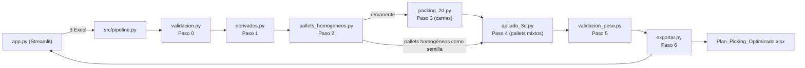

# Agente Cubicador

Herramienta que recibe la demanda de despacho, el maestro de SKUs y las dimensiones/peso de cada caja (3 hojas de Excel), y genera un plan de picking optimizado por pallet: cuántos pallets arma cada Centro de Distribución (CD), qué va en cada uno y en qué orden vertical, respetando reglas de estabilidad, peso máximo y espacio físico (120×100 cm de base, 190–195 cm de altura total).

La lógica de negocio completa (reglas, supuestos validados contra data real, catálogo de estados, decisiones de diseño) está documentada en **[`Diseno_Motor_Optimizacion_Pallets.md`](Diseno_Motor_Optimizacion_Pallets.md)**. Este README cubre la arquitectura de archivos, cómo correr el proyecto y cómo se conecta cada módulo — no duplica las reglas de negocio.

---

## Estructura del proyecto

```
Agente Cubicador/
├── app.py                  # Interfaz Streamlit (punto de entrada de la app)
├── config.py                # Constantes del sistema (medidas, umbrales, estados) — ver sección 6/12 del doc de diseño
├── models.py                 # Dataclasses compartidas (Pallet, Cama, Placement, PalletLinea, LogEntry, ResultadoPipeline)
├── visualizacion.py          # Dibuja pallets y camas con matplotlib (usado por app.py)
├── src/
│   ├── validacion.py         # Paso 0 — carga los 3 Excel, aplica reglas V1–V9, genera Log_Validacion
│   ├── derivados.py          # Paso 1 — cruce por SKU + campos derivados (Peso_Caja, Cajas_Cama_Efectivo, Nivel_Categoria...)
│   ├── pallets_homogeneos.py # Paso 2 — arma pallets 100% de un solo SKU (PH-HOM-*)
│   ├── packing_2d.py         # Paso 3 — agrupa remanentes en "camas" (capas del pallet) por nivel de categoría
│   ├── apilado_3d.py         # Paso 4 — apila camas en pallets mixtos (PH-MIX-*), best-fit + consolidación
│   ├── validacion_peso.py    # Paso 5 — calcula peso por pallet y marca alertas
│   ├── exportar.py           # Paso 6 — arma los DataFrames de salida y el Excel final
│   ├── pipeline.py           # Orquesta Pasos 0–6 (ejecutar_pipeline / ejecutar_desde_archivo)
│   └── template.py           # Genera la plantilla de ejemplo descargable desde la UI
├── tests/                    # Suite pytest, un archivo por módulo de src/ + tests de integración con data real
├── Diseno_Motor_Optimizacion_Pallets.md  # Documento de diseño: reglas de negocio, supuestos, casos borde
├── requirements.txt
└── Cubicaje*.xlsx            # Datasets reales usados para validar el diseño (no son parte del código)
```

## Flujo de datos (alto nivel)



`pipeline.ejecutar_pipeline(envios, maestro, uma)` es el único punto de entrada a la lógica de negocio; recibe los 3 DataFrames ya leídos y devuelve un `ResultadoPipeline` (`models.py`) con:

- `plan_picking_df`, `log_validacion_df`, `resumen_cd_df` — los 3 DataFrames que se exportan tal cual a las 3 hojas del Excel de salida.
- `pallets` — lista de objetos `Pallet` (con sus `Cama` y `Placement` internos), usada por `app.py`/`visualizacion.py` para el inspector visual.
- `info_sku` — diccionario `SKU → metadata` (categoría, peso, etc.) usado para pintar el detalle de cada cama.

`app.py` es la única capa que sabe de Streamlit; no contiene lógica de negocio — solo arma la UI, llama a `pipeline.ejecutar_pipeline` y delega el dibujo a `visualizacion.py`.

## Cómo correr el proyecto

```powershell
# Crear/activar entorno virtual (ya existe env/ en este repo, o crear uno nuevo)
python -m venv env
env\Scripts\activate

# Instalar dependencias
pip install -r requirements.txt

# Levantar la app
streamlit run app.py
```

Desde la UI se puede subir un solo Excel con las 3 hojas (`Envios_Julio`, `Maestro_SKUs`, `UMA`) o los 3 archivos por separado. El botón "Descargar plantilla de ejemplo" genera un Excel de muestra vía `src/template.py`, con una hoja `Instrucciones` que explica cada columna.

## Tests

```powershell
pytest
```

`tests/` tiene un archivo por módulo de `src/` (`test_validacion.py`, `test_derivados.py`, `test_packing_2d.py`, `test_apilado_3d.py`, `test_topado_homogeneos.py`) más `test_pipeline_real_data.py`, que corre el pipeline completo contra los datasets reales (`Cubicaje*.xlsx`) para detectar regresiones de comportamiento frente a los casos ya validados. `tests/conftest.py` expone `dataset_factory`, un fixture para construir los 3 DataFrames de input con overrides mínimos.

## Constantes del sistema

Todas las medidas, umbrales y strings de estado viven en `config.py` (una sola fuente de verdad) — ver secciones 6 y 12 de `Diseno_Motor_Optimizacion_Pallets.md` para el porqué de cada valor. Si un valor de negocio cambia (ej. la ventana de altura, el umbral de alerta de peso), se cambia ahí y en ningún otro lugar.

## Relación con el documento de diseño

`Diseno_Motor_Optimizacion_Pallets.md` es la fuente de verdad de **negocio** (qué debe hacer el sistema y por qué); este README es la fuente de verdad de **arquitectura de código** (dónde vive cada cosa y cómo correrla). El documento de diseño incluye notas **"[Implementación real]"** en los puntos donde el código terminó resolviendo algo distinto a la propuesta original (notablemente: el algoritmo de apilado del Paso 4 y el mecanismo de anti-fragmentación) — revisar esas notas antes de asumir que la sección narrativa original describe el comportamiento actual al pie de la letra.
